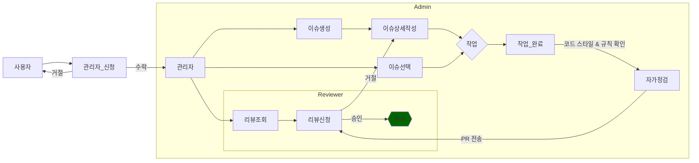

# 관리자 지침
## PR 요청 체크 리스트
Pull Request 전에는 꼭 확인하여 올려주시기 바랍니다.
- 우리의 [코드 행동 강령](https://github.com/liebespaar93/liebespaar93.github.io/blob/1-git-%ED%99%98%EA%B2%BD-%EC%84%A4%EC%A0%95/CODE_OF_CONDUCT.md)을 준수하는가.
- [코딩 스타일](#코딩-스타일)를 준수 하였는지 확인하세요
- [단위 테스트](#단위-테스트)를 완료 했는지 확인하세요

관리자의 코드 제출 방법


# 코딩 스타일
## 자바스크립트
```js
function TabSize()
{
  console.log("1. 2칸으로한다");
  console.log("2. 스페이스보단 tab으로 작업한다");
}
```
- 건의사항 [구글 스타일 가이드](https://google.github.io/styleguide/jsguide.html) 확인해보기
## 타입스크립트
```ts
interface I_prop{
  name: string;
  age: number;
}

type T_prop = {
  name: string;
  age: number;
} 
```
## 마크타운
```markdown
# 의경우 링크를 이용하여 이동하기 쉽게 설계
  ex) [목차 이동](#밑에-목차-이동)
  # 밑에 목차 이동
```
# 단위 테스트
- [ ] 병합 혹은 충돌이 없는 상태인지 확인한다.
- [ ] 코드 스타일이 맞는지 확인한다.
- [ ] 로컬 환경에서 확인 가능한 부분 확인한다.
- [ ] 질문이 있을경우 커뮤니티에 질문을 올려 상담을 한다.
- [ ] 커밋로그가 정리가 되었는지 확인한다.
